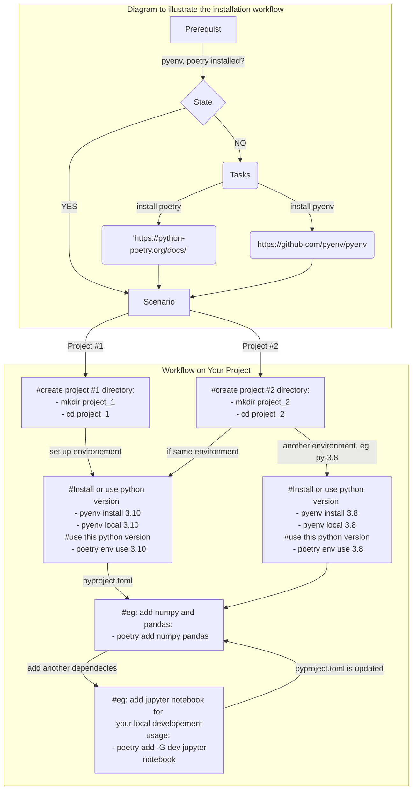

# Powerful combination for managing Python environments and dependencies

Combining Poetry and Pyenv in data science, analytics, or engineering work allows you to efficiently manage Python environments, dependencies, and version requirements. This, in turn, helps you maintain a clean and organized development environment, achieve reproducibility, and collaborate effectively with team members, all of which are critical aspects of data-centric tasks.

## Environment Management:

Why: Different projects may require specific Python versions and libraries. Pyenv helps manage these Python versions.

Example: You are working on a data analysis project where Python 3.7 is required, but your other project uses Python 3.9. Pyenv allows you to switch between these versions as needed.

## Dependency Management:

Why: Data projects often rely on many Python packages. Poetry simplifies managing these dependencies.

Example: You need to ensure your data analysis project includes pandas 1.0.1 and numpy 1.18.1. Poetry lets you define and manage these dependencies efficiently.

## Isolation:

Why: To prevent conflicts between different projects, you need isolated environments. Poetry can create project-specific virtual environments, and Pyenv can manage the Python version within those environments.

Example: Your machine learning project requires Python 3.6 and specific libraries. Poetry sets up a virtual environment for this project, and Pyenv ensures Python 3.6 is used within that environment.

## Reproducibility:

Why: Reproducibility is vital in data work. Poetry allows you to specify precise dependency versions, ensuring you can recreate the exact environment later. Pyenv complements this by specifying and managing the Python version.

Example: You want to share your analysis with a colleague, and with Poetry and Pyenv, you can guarantee they have the same Python environment and dependencies, making replication easy.

## Cross-Platform Compatibility:

Why: Data work often spans different platforms. Both Poetry and Pyenv work on various operating systems, ensuring a consistent experience.

Example: You collaborate with a team where some members use macOS, others use Windows, and a few use Linux. Poetry and Pyenv provide a common environment management solution for all.

## Collaboration:

Why: Working collaboratively in data science is common. Poetry and Pyenv ensure that everyone uses the same Python version and dependencies.

Example: Your data science team is working on a shared project. Poetry and Pyenv make it easy for each team member to have the correct environment for the project, promoting efficient collaboration.

## Here's a basic flowchart representing the workflow combining Pyenv and Poetry:

you can use this as a reference to visualise or to illustrate the workflow if needed.

